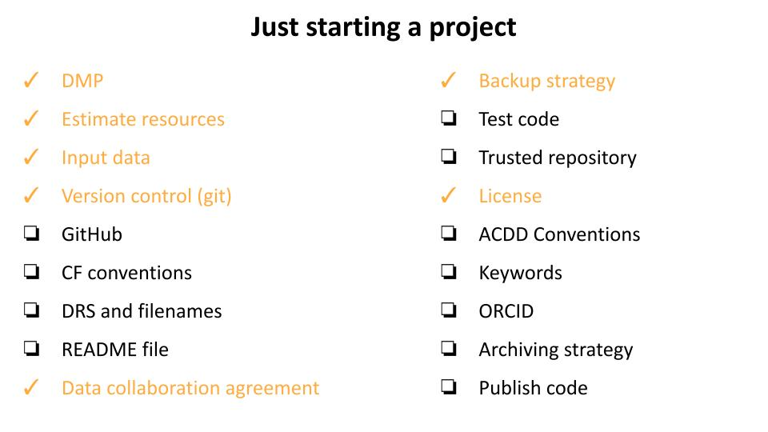
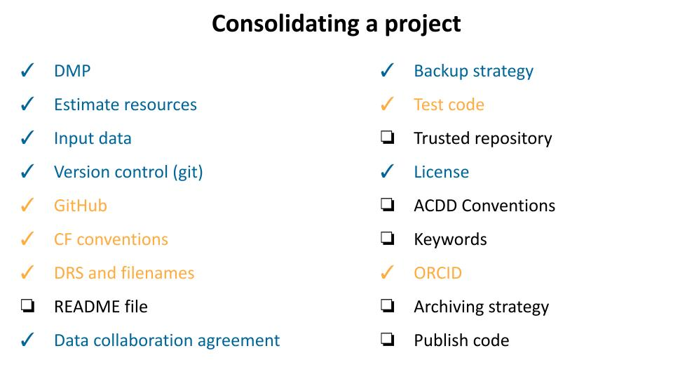
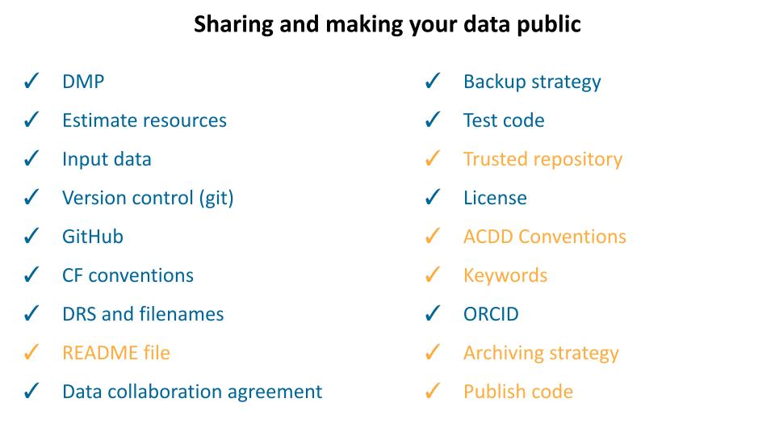

# Checklists for data management in the project lifecycle

These checklists represent what a dataset evolution might look like at different stages of a project.
Not all of these action will have the same relevance for different projects and some datasets might need further specific actions.
The checklists highlight in `yellow` what should be accomplish at each stage and in `blue` what should have already happened.

