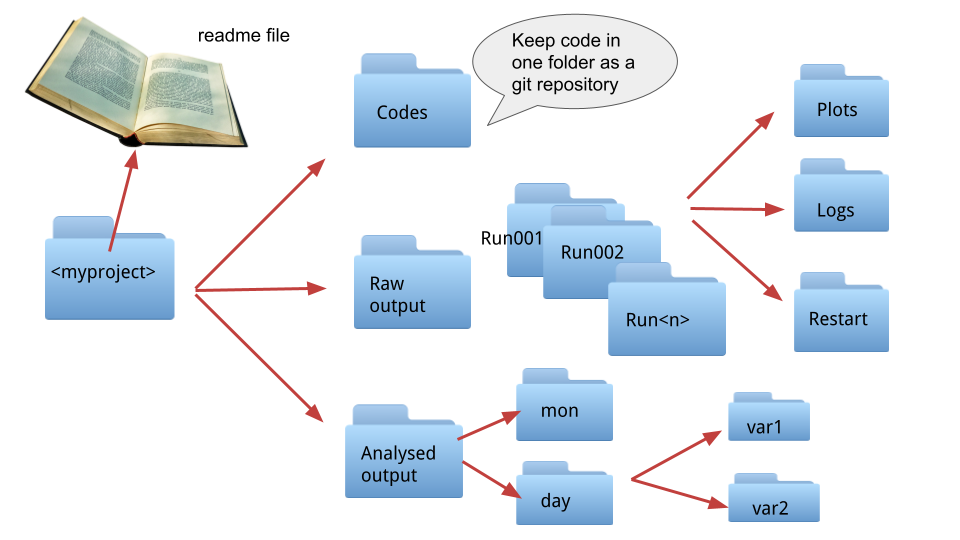

# Choosing a directory structure (DRS) and filenames

The names you choose for files and directories and generally the way you organise your data, i.e. your directory structure can help navigating the data and provide extra information, avoid confusion and the user ending up accessing the wrong data. As for many other cases the best file organisation will depend on the specific research project and the actual server where the data is stored. The global climate modelling intercomparison project (CMIP) has adopted a **Data Reference Syntax (DRS)**, based on the **controlled vocabularies (CVs)** used in model metadata, to define their file names and directory structures. 
Here we list a few guidelines and tips to help you decide.  

## General considerations
* Familiarise yourself with the storage system, make sure you are storing the files in the most appropriate place, get to know if the storage is backed up or not, what is your allocation, and also what rules or best practices apply.
* Take into account how yourself or others might want to use the data, this is particularly important when deciding the DRS but also how to divide data across files for big dataset as model output. Doing so at the start of the project will spare you lots of time you might otherwise spend re-processing all your files.
* Be consistent, this applies both to the organisation and the naming, consistency is essential for the data to be machine-readable, i.e. data which is easy to access by coding. In fact, use community standards and/or controlled vocabularies wherever possible.
* Consider adding a `readme` file in the main directory, including an explanation of the DRS and the naming conventions, abbreviation and/or codes you used. If you used standards and controlled vocabularies all you have to do is to include a link to them.    

## DRS

The figure above shows an example of an organised working directory for a model output. 

**Things to consider:**

* Try to organise files in directories based on type and how you process them
for the final output think also about how others might use them: are they going to be used for analysis or they could be used as forcing or restart files for a model? 
* If there is an existing DRS defined for an analogous data product (e.g. input data to a climate analysis workflow), would it help yourself and others to structure your output following a similar convention?
* Think of the way you would access these directories in a code, as an example having the variable directories using exactly the same name as the actual variable.
* Make sure your code is separate from your data, you want to be able to use something like git to version control it and possibly GitHub to back it up easily.
* Have at least one `readme` file with detailed metadata, possibly more if you have a lot of directories/files. You cannot realistically use git for managing versions of data but you can use git to version control your `readme` files.
* Review at regular intervals what you are keeping, what needs to be removed and how things are organised.

**Reference examples:**

* The CMIP6 DRS is defined in the [CMIP6 Controlled Vocabularies document](https://docs.google.com/document/d/1h0r8RZr_f3-8egBMMh7aqLwy3snpD6_MrDz1q8n5XUk/edit), starting on p.13.
* The [CORDEX DRS](http://is-enes-data.github.io/CORDEX_adjust_drs.pdf) builds on the CMIP DRS to apply to regional climate models.
